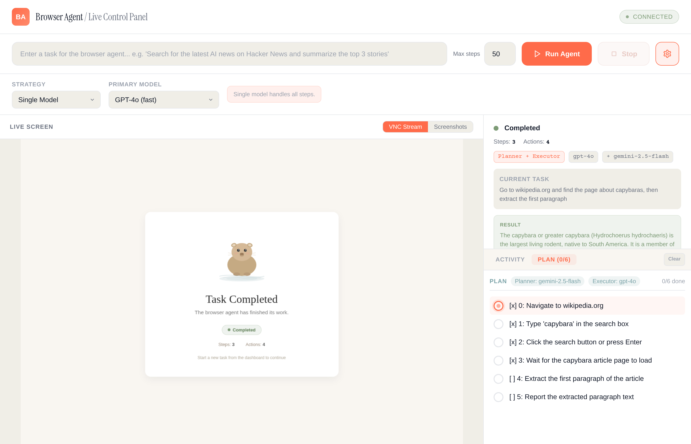
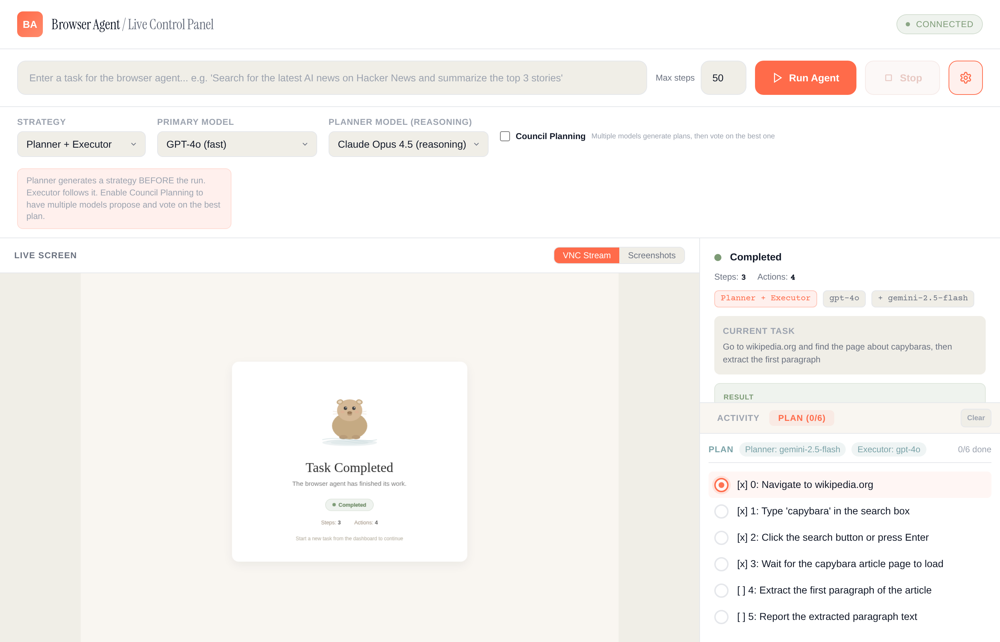
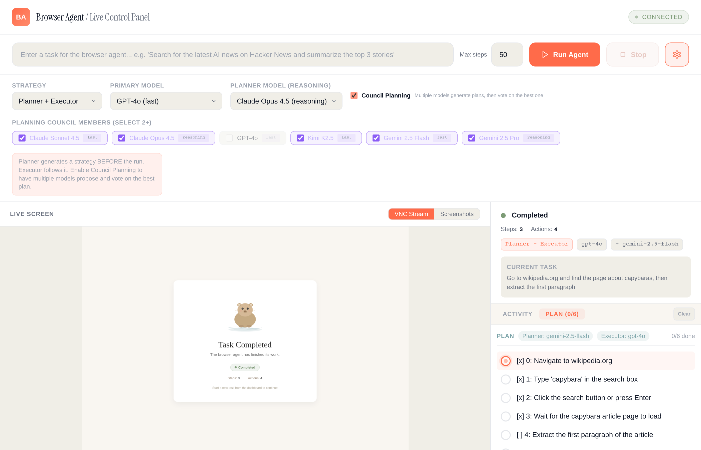
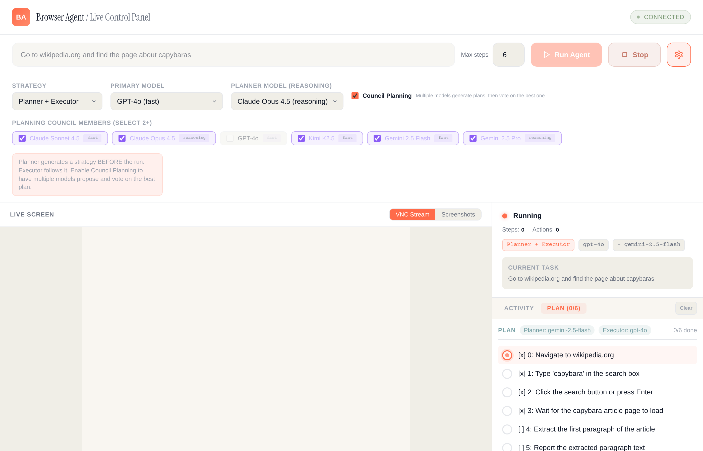
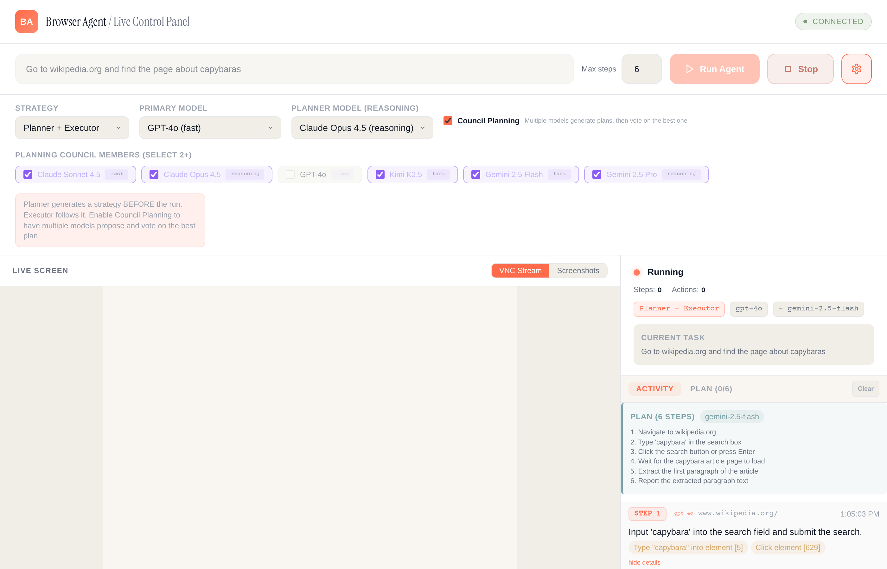
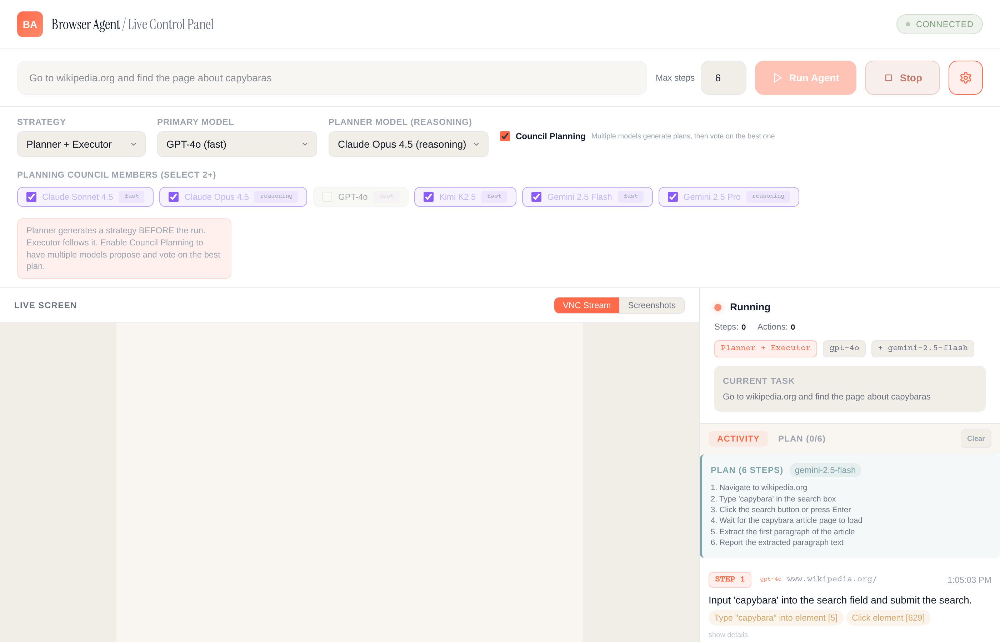
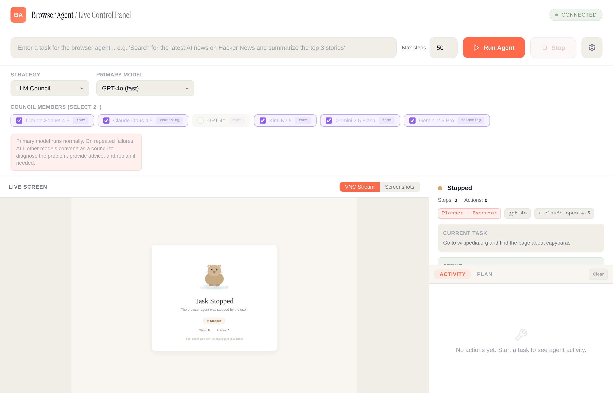

# HappyCapy Browser Agent

Full-stack AI browser automation system with multi-model LLM strategies, real-time dashboard, and live VNC streaming. Built on [browser-use](https://github.com/browser-use/browser-use) 0.11.9, FastAPI, and Playwright.

Give the agent a task in plain English -- it controls a real Chromium browser to complete it. Watch every step live through VNC streaming or periodic screenshots, with full agent reasoning visible in real time.


---

## Features at a Glance

- **6 LLM models** from 4 providers (Anthropic, OpenAI, Google, Moonshot) -- selectable from the dashboard
- **5 multi-model strategies** for reliability, quality, and resilience
- **Council Planning** -- multiple models generate plans independently, then vote on the best one
- **Live VNC streaming** -- watch the browser in real time via embedded noVNC
- **Plan tab** with step-by-step progress indicators (done/current/pending)
- **Compact activity log** with collapsible reasoning details
- **Capybara splash screen** shown when idle, completed, failed, or stopped
- **Real-time WebSocket** updates for all agent events
- **Single-file dashboard** -- no build step, no dependencies, just HTML

---

## Multi-Model Strategies

Click the gear icon in the top-right corner to open the model configuration bar.



Five strategies let you combine multiple LLM models for different goals:

| Strategy | How It Works | When to Use |
|----------|-------------|-------------|
| **Single** | One model handles all steps | Simple tasks, cost-sensitive |
| **Fallback Chain** | Primary runs; auto-switches to secondary on error/rate-limit | Reliability |
| **Planner + Executor** | Strong model plans first; fast model executes browser steps | Complex multi-step tasks |
| **Consensus (Judge)** | Primary acts; judge model validates every step + final verdict | Quality-critical tasks |
| **LLM Council** | Primary runs; on failure/loop/stall, all council models convene to diagnose, advise, and replan | Hard tasks, anti-stall |

---

## Planner + Executor

Select the **Planner + Executor** strategy to split planning from execution. A reasoning model generates a high-level plan before the run starts. A fast model then follows the plan step-by-step in the browser.



The plan appears in both the **Activity** tab (as a summary card) and the **Plan** tab (as interactive step indicators).

### Council Planning

Enable the **Council Planning** checkbox to have multiple models each generate a plan independently, then vote on the best one. This produces higher-quality plans by combining different perspectives.



How it works:

1. **Phase 1 -- Plan Generation**: All selected council members independently produce a numbered plan (in parallel)
2. **Phase 2 -- Voting**: Each member votes for the best plan (not their own), judging on specificity, completeness, conciseness, and correct ordering
3. **Winner Selection**: The plan with the most votes is injected into the executor agent. Ties are broken by plan thoroughness.

---

## Live Dashboard

### Task Running

When a task is running, the left panel shows the live browser via VNC streaming. The right panel shows real-time status, current task, strategy badges, and the tabbed log panel.



### Plan Tab

The **Plan** tab shows each step from the generated plan with radio-style progress indicators:

- **Pulsing coral dot** -- current step being executed
- **Green checkmark** -- completed step (struck through)
- **Empty circle** -- pending step
- **Dashed circle** -- skipped step

The tab badge shows progress like "Plan (2/6)".


### Activity Log

The **Activity** tab shows a compact log of each agent step. Each entry displays:

- **Step badge** with number
- **Model tag** (which LLM produced this step)
- **URL** the browser is on
- **Timestamp**
- **Next goal** -- the agent's stated intent (the main visible content)
- **Action pills** -- what the agent actually did (click, type, scroll, etc.)
- **"show details"** toggle -- expands to reveal the full evaluation, internal reasoning, and memory


Click "show details" on any entry to see the agent's full reasoning:



### Task Completed

When a task finishes, a result card appears with the agent's output. The VNC area shows a capybara splash screen indicating the task status.



---

## LLM Council Strategy

The LLM Council is the most advanced strategy. Select it to see the council member picker, where you choose which models participate.



A single primary model runs the task normally. When it gets stuck, **all selected council members convene** to diagnose the problem, provide advice, and optionally propose a revised plan.

### Council Triggers

| Trigger | Threshold | What Happens |
|---------|-----------|--------------|
| **Consecutive failures** | 2+ errors | Council convenes with error context |
| **Action loop** | 3 identical actions | Council diagnoses why the agent is repeating itself |
| **Step stall** | 60+ seconds | Council investigates why the step is hanging |

### 3-Tier Loop Detection

1. **Strict fingerprint** -- Exact match on normalized URL + action type + target element + input text (3 repeats)
2. **Loose fingerprint** -- Same action type + same domain only (4 repeats)
3. **URL stall** -- Same URL with no new extracted content (5 repeats)

### Council Recovery Flow

1. All council members are queried **in parallel** with the current state, action history, and error context
2. Each member provides: **DIAGNOSE** (root cause), **ADVICE** (next action), and optionally **REPLAN** (revised steps)
3. Council feedback is injected into the agent's memory via `ActionResult.long_term_memory`
4. If a council member proposes a replan, it replaces `agent.state.plan`
5. 3-step cooldown between loop-triggered councils to prevent meta-loops

---

## Available Models

Six models from four providers, all with vision support:

| Model | Provider | Tier | ID |
|-------|----------|------|----|
| Claude Sonnet 4.5 | Anthropic | fast | `anthropic/claude-sonnet-4.5` |
| Claude Opus 4.5 | Anthropic | reasoning | `anthropic/claude-opus-4.5` |
| GPT-4o | OpenAI | fast | `openai/gpt-4o` |
| Kimi K2.5 | Moonshot AI | fast | `moonshotai/kimi-k2.5` |
| Gemini 2.5 Flash | Google | fast | `google/gemini-2.5-flash` |
| Gemini 2.5 Pro | Google | reasoning | `google/gemini-2.5-pro` |

To add more models, add entries to the `AVAILABLE_MODELS` list in `agent_server.py`. They automatically appear in the dashboard dropdowns and are available as council members.

---

## Architecture

```
                                  +------------------+
 [Browser Dashboard]  <---WS---> |  FastAPI Server   | <--controls--> [browser-use Agent]
   (single HTML SPA)             |  agent_server.py  |                       |
                                  +------------------+                       v
 [Browser Dashboard]  <-noVNC->  [x11vnc :5999] <--- [Xvfb :99] <--- [Chromium]
```

### Display Stack

```
Xvfb :99 (1280x900x24)  -->  x11vnc :5999  -->  noVNC/websockify :6080
```

- **Xvfb** -- Virtual framebuffer where Chromium renders
- **x11vnc** -- VNC server exposing the framebuffer
- **noVNC** -- Browser-based VNC client (served from `/usr/share/novnc/`)
- The dashboard embeds noVNC in an iframe, plus periodic screenshot mode as fallback

### Files

| File | Purpose |
|------|---------|
| `agent_server.py` | FastAPI backend: multi-model orchestration, WebSocket, Xvfb/VNC/noVNC management, council logic |
| `dashboard.html` | Single-file SPA dashboard: model picker, live VNC, plan tab, activity log |
| `start.sh` | Startup script with prerequisite checks |
| `setup.sh` | One-click installation of all dependencies |

---

## Quick Start

### 1. Run setup

```bash
bash setup.sh
```

This installs system dependencies (Xvfb, x11vnc, noVNC, ImageMagick), creates a Python virtual environment, installs browser-use + FastAPI + Playwright + Chromium, and verifies everything works.

### 2. Set your API key

```bash
export AI_GATEWAY_API_KEY="your-openai-compatible-api-key"
```

The server uses an OpenAI-compatible gateway. Any provider that speaks the OpenAI chat completions API works.

### 3. Start the server

```bash
./start.sh
```

Or manually:

```bash
DISPLAY=:99 /home/node/browser-agent-venv/bin/python3 agent_server.py
```

### 4. Open the dashboard

Navigate to `http://localhost:8888` (or whatever `AGENT_PORT` is set to).

---

## Configuration

| Environment Variable | Default | Description |
|---------------------|---------|-------------|
| `AI_GATEWAY_API_KEY` | (required) | API key for the LLM gateway |
| `AGENT_PORT` | `8888` | Dashboard + API port |
| `BROWSER_AGENT_MODEL` | `openai/gpt-4o` | Default model |
| `BROWSER_AGENT_VENV` | `/home/node/browser-agent-venv` | Python venv path |

---

## API Reference

| Endpoint | Method | Description |
|----------|--------|-------------|
| `/` | GET | Dashboard HTML |
| `/api/models` | GET | Available models + strategies |
| `/api/agent/start` | POST | Start a task |
| `/api/agent/stop` | POST | Stop running task |
| `/api/agent/status` | GET | Current status, action log, plan progress, result |
| `/ws` | WebSocket | Real-time updates (step, status, screenshot, plan, plan_progress, judge/council verdicts) |

### Start a task (HTTP)

```bash
curl -X POST http://localhost:8888/api/agent/start \
  -H "Content-Type: application/json" \
  -d '{
    "task": "Go to google.com and search for AI news",
    "max_steps": 50,
    "model_config_data": {
      "strategy": "planner_executor",
      "primary_model": "openai/gpt-4o",
      "secondary_model": "google/gemini-2.5-pro"
    }
  }'
```

### Start a task with council planning (HTTP)

```bash
curl -X POST http://localhost:8888/api/agent/start \
  -H "Content-Type: application/json" \
  -d '{
    "task": "Search for capybara facts on Wikipedia",
    "max_steps": 10,
    "model_config_data": {
      "strategy": "planner_executor",
      "primary_model": "openai/gpt-4o",
      "secondary_model": "google/gemini-2.5-flash",
      "use_council_planning": true,
      "council_members": [
        "anthropic/claude-sonnet-4.5",
        "google/gemini-2.5-flash",
        "openai/gpt-4o"
      ]
    }
  }'
```

### Start a task (WebSocket)

```json
{
  "type": "start_task",
  "task": "Search for AI news on Hacker News",
  "max_steps": 50,
  "model_config": {
    "strategy": "council",
    "primary_model": "openai/gpt-4o",
    "council_members": ["anthropic/claude-sonnet-4.5", "google/gemini-2.5-flash"]
  }
}
```

### WebSocket message types

| Type | Direction | Description |
|------|-----------|-------------|
| `start_task` | client -> server | Start a new agent task |
| `stop_task` | client -> server | Stop the running task |
| `status` | server -> client | Agent status update (running/completed/failed/stopped) |
| `step` | server -> client | Agent step data (thought, actions, evaluation, etc.) |
| `screenshot` | server -> client | Base64-encoded screenshot |
| `plan` | server -> client | Generated plan text (planner_executor strategy) |
| `plan_progress` | server -> client | Plan step status updates (done/current/pending/skipped) |
| `warning` | server -> client | Warning message (e.g., missing secondary model) |
| `judge_verdict` | server -> client | Consensus judge evaluation result |
| `council_verdict` | server -> client | LLM Council diagnosis, advice, and replan |

---

## Troubleshooting

### Browser launch timeout (`BrowserStartEvent timed out after 30.0s`)

Chromium is missing shared libraries. Fix:

```bash
/home/node/browser-agent-venv/bin/python3 -m playwright install-deps chromium
```

This installs libatk, libasound, libxkbcommon, fonts, and ~40 other system libraries that Chromium needs at runtime. This is separate from `playwright install chromium` which only downloads the browser binary.

### Verify Chromium works

```bash
DISPLAY=:99 /home/node/.cache/ms-playwright/chromium-*/chrome-linux64/chrome --version
```

If it prints a version, it's working. If it errors with `cannot open shared object file`, run `install-deps` above.

### Xvfb lock file error

```bash
rm -f /tmp/.X99-lock
pkill -9 Xvfb
```

### Port already in use

```bash
export AGENT_PORT=9222  # or any free port
```

### noVNC not loading

```bash
sudo apt-get install -y novnc
```

Ensure `/usr/share/novnc/` exists after installation.

---

## Project Structure

```
.
├── agent_server.py         # FastAPI backend (also at scripts/agent_server.py)
├── dashboard.html          # Single-file SPA dashboard (also at scripts/dashboard.html)
├── setup.sh                # One-click installation
├── start.sh                # Startup script with checks
├── assets/
│   ├── 01-dashboard-idle.png
│   ├── 02-model-config.png
│   ├── 03-planner-executor-config.png
│   ├── 04-council-planning-config.png
│   ├── 05-task-running.png
│   ├── 06-plan-tab.png
│   ├── 07-activity-log.png
│   ├── 08-task-status.png
│   ├── 09-log-details-expanded.png
│   └── 10-council-strategy-config.png
├── scripts/                # Canonical source copies
│   ├── agent_server.py
│   ├── dashboard.html
│   ├── setup.sh
│   └── start.sh
├── SKILL.md                # Claude Code skill definition
└── README.md
```

---

## Implementation Notes

- `browser-use` ChatOpenAI returns `ChatInvokeCompletion` with `.completion` field (not `.content`)
- `agent.state.plan` is mutable from `on_step_end` hook -- changes affect the next step
- `ActionResult.long_term_memory` gets injected into the next step's context via MessageManager
- `agent.state.consecutive_failures` tracks errors; reset on success
- The `on_step_end` hook signature: `AgentHookFunc = Callable[['Agent'], Awaitable[None]]`
- Dashboard is a single HTML file with inline CSS/JS (no build step)
- noVNC served from system install at `/usr/share/novnc/`

## License

MIT
